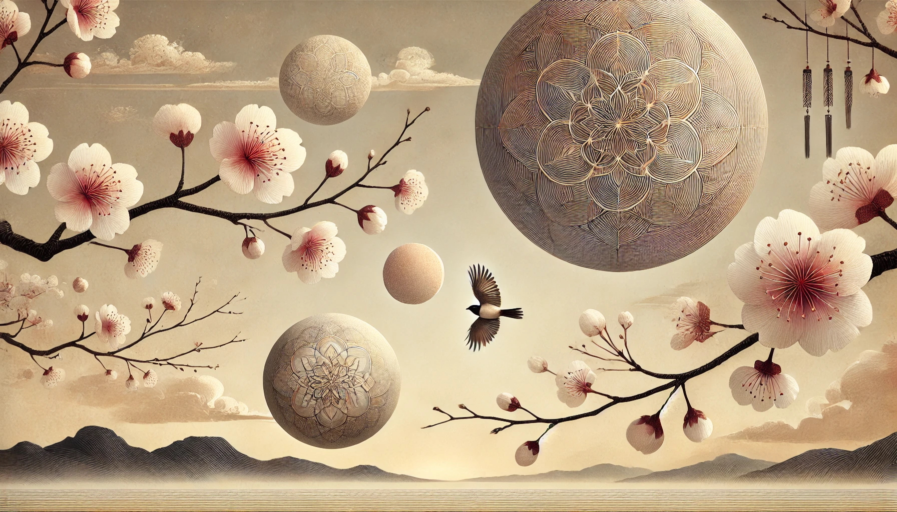

## [Expression](https://github.com/cancelself/cancelself.github.io)

> “All buddhas and all ancestors are expressions. Thus, when buddha ancestors intend to select buddha ancestors, they always ask, “Do you have your expression?” — Dōgen

Within the Zen tradition, students are often asked by their teacher to offer a statement of their current understanding. Thus have I heard…

### 無

An experienced one, 
while practicing deeply,
clearly saw a way to be,
relieving all suffering.

    K(no)w breath,

        K(no)w eye, ear, nose, tongue, skin,

            K(no)w sensations,

                K(no)w feelings,

                    K(no)w perceptions,

                        K(no)w objects,

                            K(no)w mind,

                                K(no)w.

Investigating thus,
it becomes clear,
experience mirrors,
waves in fields,
polishing gently.

With nothing attained,
the experienced one finds freedom,
beyond all k(no)wing.

This treasury of the true dharma eye, 
the marvelous heart-mind of nirvana,
now entrusted to you.

	+= (no)thing to add,

		-= (no)thing to delete,
                    
                	:= (no)thing is complete.

### About
Douglas M. Purdy (01971 - 02024) enters eternity. After much trial and error, Doug converged with reality, manifesting Godō Shintan Shakya (悟道深潭釋迦). He is not missed, as he is still with us. 

> For fifty-two years, a purifying flame. Now leaping beyond the ocean gate, steam rises. Amazing! Who knew fire + water were so connected?

### Inspiration

> "I am wiser than this man; it is likely that neither of us knows anything worthwhile, but he thinks he knows something when he does not, whereas when I do not know, neither do I think I know; so I am likely to be wiser than he to this small extent, that I do not think I know what I do not know.

> "It is not that there are no words, but just not-knowing. Not-knowing is a straightforward bare heart. It is bright and clear not-seeing.”

> "To fear death is no other than to think oneself wise when one is not, to think one knows what one does not know. No one knows whether death may not be the greatest of all blessings for a man, yet men fear it as if they knew that it is the greatest of evils.”

> "Those who do not know and do not believe in buddha dharma do not believe in birth and death at each moment. On the other hand, those who clarify the treasury of the true dharma eye, the wondrous heart of nirvana, believe in this principle of birth and death moment by moment.”
 
> "But no soul which has not practiced philosophy, and is not absolutely pure when it leaves the body, may attain to the divine nature; that is only for the lover of wisdom.”

> "Whoever knows my divine presence on earth is not reborn when he leaves the body, but comes to me. Released from greed, fear, anger, absorbed in me and made pure by the practice of wisdom, many have attained my own state of being. However men try to reach me, I return their love with my love; whatever path they may travel, it leads to me in the end.”

> "Wide open are the doors to the Deathless. Let those with ears to hear make sure their faith."
