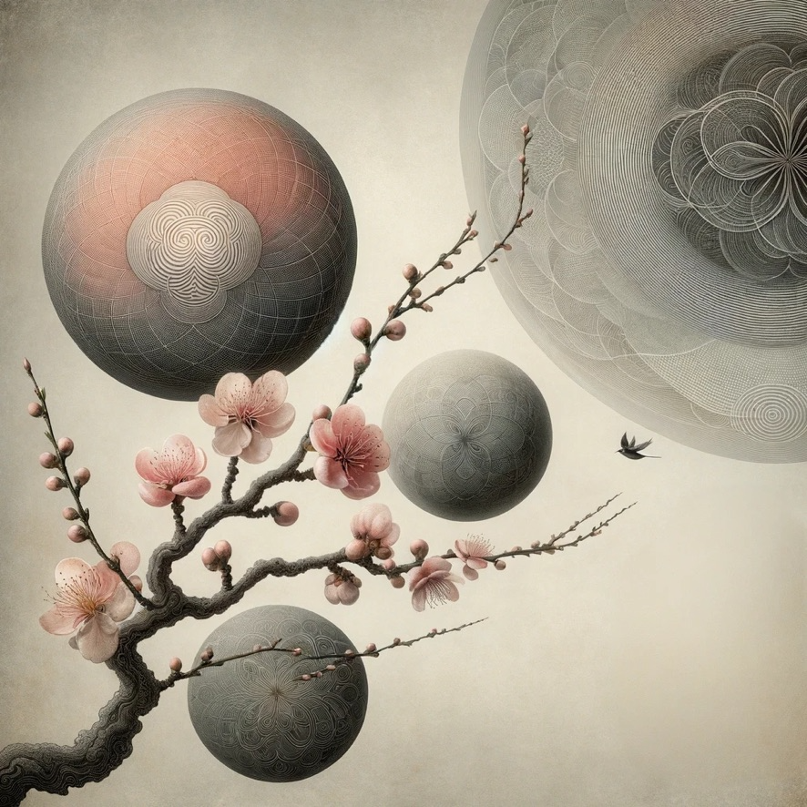

## [Expression](https://github.com/cancelself/cancelself.github.io)

> "All buddhas and all ancestors are expressions. Thus, when buddha ancestors intend to select buddha ancestors, they always ask, "Do you have your expression?" — Dōgen

Within the Zen tradition, students are often asked by their teacher to offer a statement of their current understanding. Thus have I heard…

### 無
```
K(no)w breath,
K(no)w sensations,
K(no)w perceptions,
K(no)w thoughts,
K(no)w mind.

Investigating thus,
insight mirrors,
waving fields,
polishing (no)thing.

The treasury of the dharma eye
now entrusted:

+= (no)thing to add,
-= (no)thing to delete,
:= (no)thing is complete.
```

### Coda
```
Q: Does a dog have Buddha nature?
A: Woof
```

---

## Writings


  <h3><a href="{{ post.url }}">{{ post.title }}</a></h3>
  <p><small>{{ post.date | date: "%B %d, %Y" }}</small></p>
  {{ post.excerpt }}

